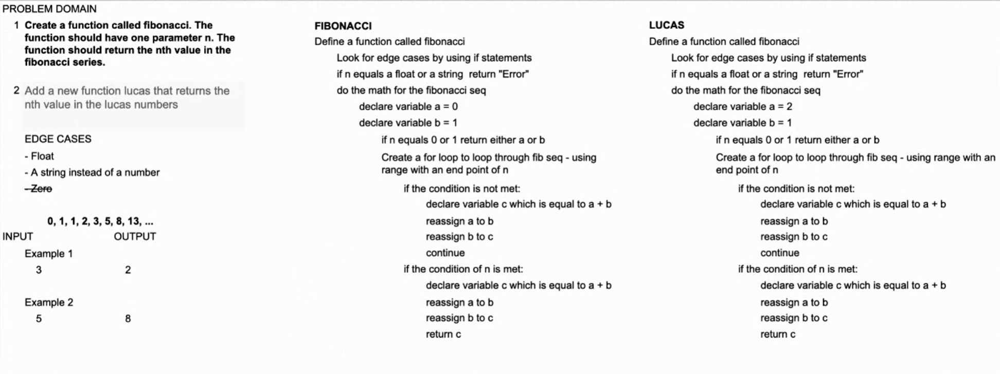

# Project: Fibonacci and Lucas numbers

## Author: [Ben Hill](https://www.linkedin.com/in/ben-hill-b4970819b/)

### Summary:

- [x] Create a function called `fibonacci`. The function should have one parameter n. The function should return the nth value in the fibonacci series. You may implement the function using recursion or iteration. If you are feeling particularly frisky, do both as separate functions.

- [x] Ensure that your function(s) has a well-formed docstring

- [x] Add a new function `lucas` that returns the nth value in the lucas numbers Again, you may use recursion or iteration, or both. Again, ensure that your function has a well-formed docstring.

- [x] Both the fibonacci series and the lucas numbers are based on an identical formula. Add a third function called sum_series with one required parameter and two optional parameters. The required parameter will determine which element in the series to print. The two optional parameters will have default values of 0 and 1 and will determine the first two values for the series to be produced.
  - Calling this function _with no optional parameters_ will produce numbers from the fibonacci series. Calling it _with the optional arguments 2 and 1_ will produce values from the lucas numbers. Other values for the optional parameters will produce other series. Again, you may use recursion or iteration, or both. Again, ensure that your function has a well-formed docstring.

### Links and Resources

- **Solutions**
  - [Fibonacci](math_series/modules/fib.py)
  - [Lucas](math_series/modules/lucas.py)
- **Resources**
  - [Fibonacci wiki](https://en.wikipedia.org/wiki/Fibonacci_number)
  - [Lucas wiki](https://en.wikipedia.org/wiki/Lucas_number)
  - [Dynamic Programming in Python](https://www.educative.io/blog/python-dynamic-programming-tutorial?aid=5082902844932096&utm_source=google&utm_medium=cpc&utm_campaign=bid_manipulation&utm_content=dynamic&gclid=Cj0KCQjwzYGGBhCTARIsAHdMTQzQFBc-DzNtIcF-cDWg6qCLCaLoBCp8PgoJfTZLVp47HVv4zpoPp5oaArKJEALw_wcB)

#### Tests

- Tests are ran using pytest via the Python extension from Visual Studio Code.

#### UML

